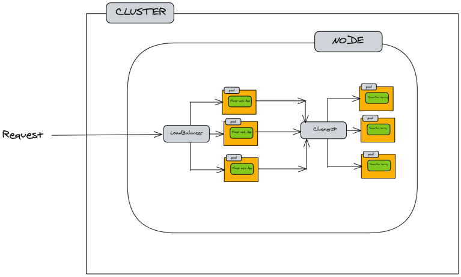

# Serving a TensorFlow model using Kubernetes
Serving a simple TensorFlow model using Docker and Kubernetes

## Description
This repository is based on https://neptune.ai/blog/kubernetes-vs-docker-for-machine-learning-engineer

- To replicate the process first we need to build two docker images:

1. For the Flask Application by running: 

```
$ docker build -t <yourdockerhubid>/tfweb:1.1 .
```

2. For the TensorFlow Serving service by running: 

```
$ docker build -t <yourdockerhubid>/tfupdate:1.1 .
```

- Then we need to start minikube using `$ minikube start` command

- We can now apply the kubernetes deployment using:

```
$ kubectl apply -f kubernetes
```

- We can now start the load balancer service:

```
$ minikube service tfweb-load-balancer-service
```

- Follow the link provided when the service is run and add /home where the Flask app is served.


 


## Prerequisites:

To get the kubernetes running on your system you need to install two programs:

[Minikube](https://minikube.sigs.k8s.io/docs/start/) which allows us to run a single-node Kubernetes 
cluster on our local computer.
And then install the Kubernetes command-line tool called
[Kubectl](https://kubernetes.io/docs/tasks/tools/).

